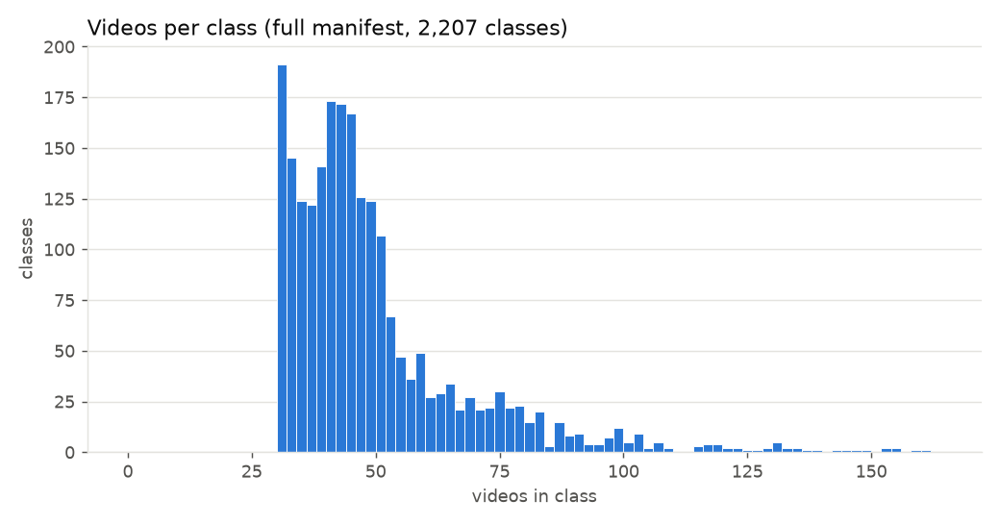
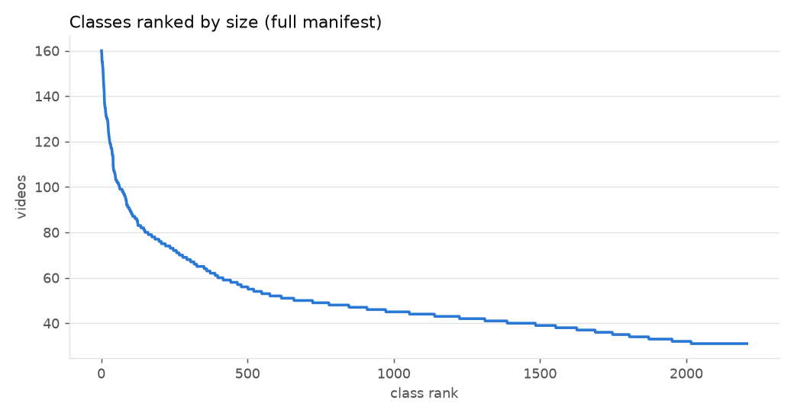
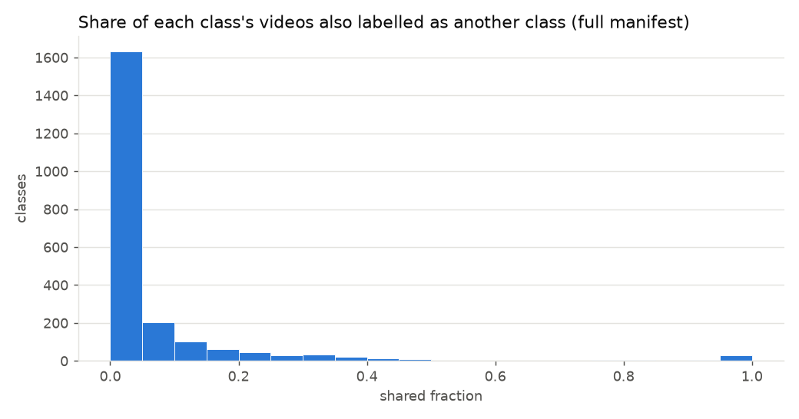
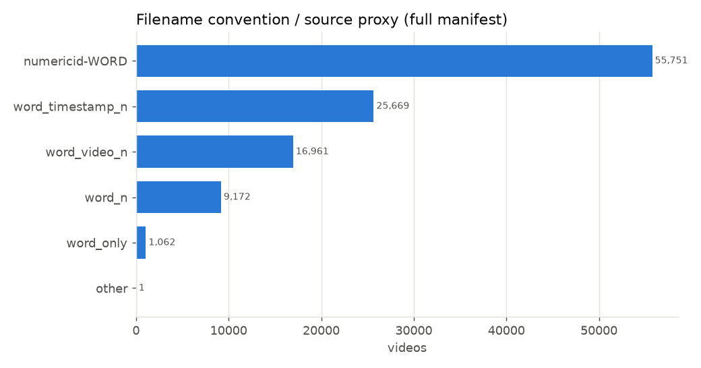
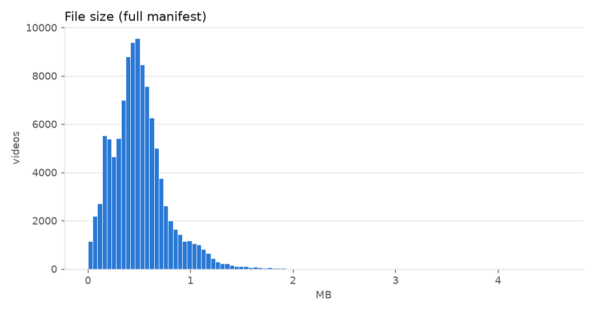
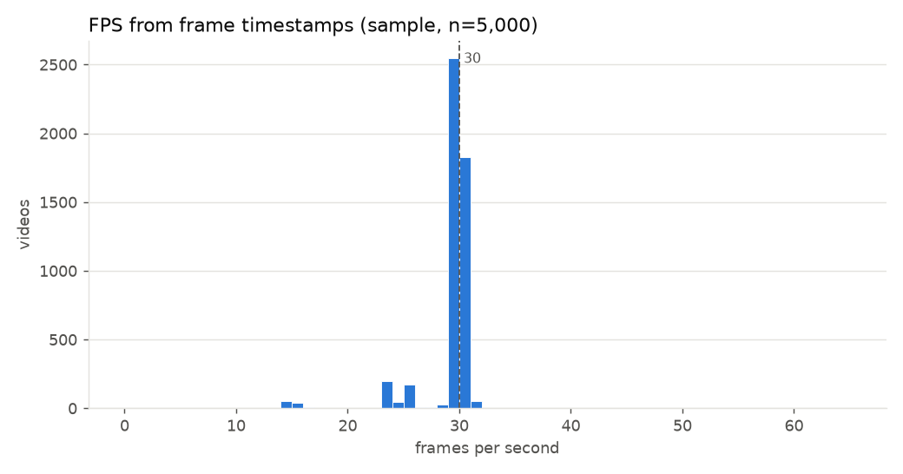
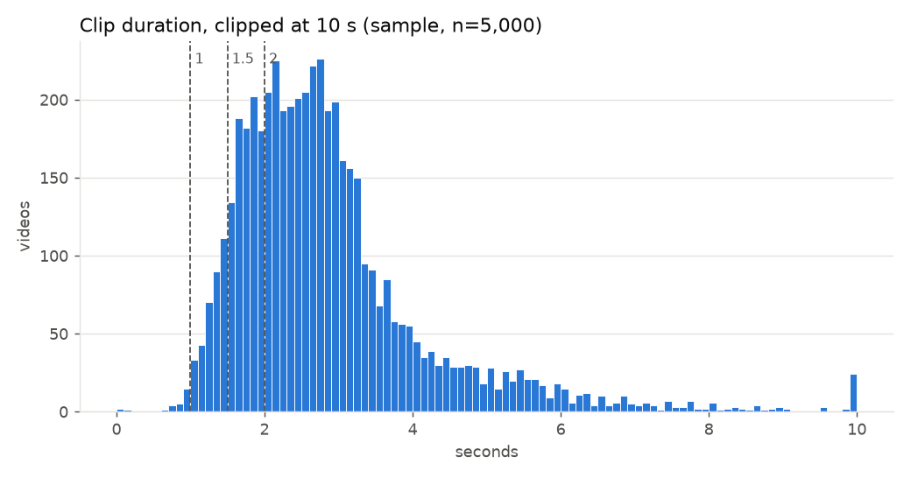
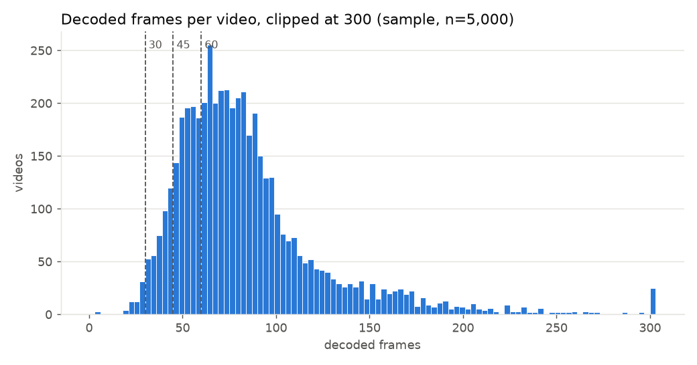
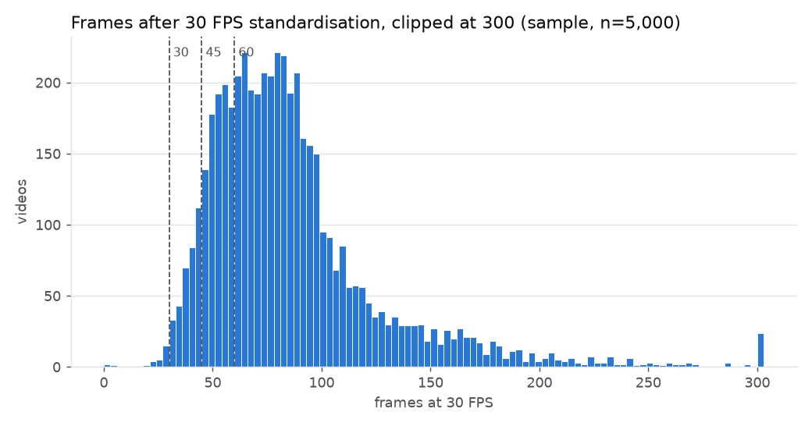
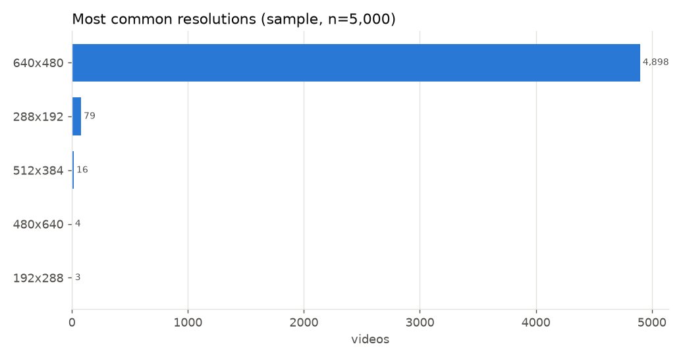

# Step 1 - Dataset validation and Representative Sample EDA

Dataset: `akasheroor/American-Sign-Language-Dataset` @ `e7979505c0dff7072ef36d45b3cddfffb50ba871`. All numbers are generated by `scripts/s1_03_eda_report.py` (`reports/step1/stats.json`).

> **How to read this report.** Part I is **exact**: computed from the complete metadata manifest (CSV + repository file list + SHA-256 of every file). Part II is **Representative Sample EDA**: video properties measured on a class-balanced sample of 5,000 videos. Part II numbers are sample statistics / estimates, **not** exact statistics for the whole dataset.

# Part I - Complete metadata (exact)

## 1. Repository vs metadata CSV

| item | value |
|---|---|
| CSV rows | 108618.00 |
| Unique words in CSV | 2207.00 |
| Video files in repository | 108616.00 |
| Total size (GB) | 54.29 |
| Samples after reconciliation | 108616.00 |
| Classes | 2207.00 |

README claims 108,618 videos / 2,208 words. The CSV columns are `word`, `videos` (bare filenames, no `part_N/` folder), not `word`, `video_path` as documented; files are resolved by filename.

Metadata checks:

| check | count |
|---|---|
| csv_rows_with_empty_word_or_filename | 0 |
| repo_files_missing_sha256 | 0 |
| csv_duplicate_filenames | 1 |
| duplicate_repo_paths_among_eligible | 0 |
| filenames_in_multiple_folders | 0 |
| repo_files_not_in_csv | 0 |
| files_listed_under_conflicting_labels | 0 |

Metadata issues (rows excluded from the manifest):

| csv_row | word | filename | issue |
|---|---|---|---|
| 13 | b | b_8.mp4 | file_missing_in_repo |
| 82 | h | h_5.mp4 | duplicate_csv_row |

## 2. Class distribution

|  | min | p5 | median | mean | p95 | max |
|---|---|---|---|---|---|---|
| videos per class | 31.0 | 31.0 | 44.0 | 49.2 | 87.0 | 160.0 |

Imbalance ratio (largest / smallest class): **5.16**

| largest | n | smallest | n  |
|---|---|---|---|
| erase | 160 | 1dollar | 31 |
| shave | 158 | letmesee | 31 |
| drown | 155 | livingroom | 31 |
| catch | 155 | longline | 31 |
| envelope | 153 | longword | 31 |
| cool | 152 | lookat | 31 |
| cry | 149 | losegame | 31 |
| pineapple | 146 | lungs | 31 |
| follow | 144 | maid | 31 |
| pop | 142 | mcdonalds | 31 |

## 3. Exact duplicate content (SHA-256)

| item | value |
|---|---|
| Groups of byte-identical files | 3,410 |
| Files in those groups | 9,218 |
| Extra copies | 5,808 |
| Groups spanning >1 label | 2,810 |
| Files in cross-label groups | 7,940 |
| Classes sharing ≥1 identical video with another class | 968 |
| Classes with ≥50% of videos shared | 56 |
| Classes with 100% of videos shared | 24 |
| Label pairs sharing videos | 1,415 |

The README says duplicates were removed; at the byte level they were not. Most duplicate groups carry *different* labels: the same clip is filed under synonym words (one clip under 20 labels). Labels are kept unchanged; such classes are partly or fully indistinguishable from video alone. Top label pairs:

| label_a | label_b | shared_videos |
|---|---|---|
| animate being | beast | 58 |
| animate being | brute | 58 |
| animate being | creature | 58 |
| beast | brute | 58 |
| beast | creature | 58 |
| brute | creature | 58 |
| animal | animate being | 54 |
| animal | beast | 54 |
| animal | brute | 54 |
| animal | creature | 54 |
| batch | deal | 51 |
| batch | good deal | 51 |
| batch | great deal | 51 |
| batch | hatful | 51 |
| batch | lot | 51 |

In the split, each SHA-256 group is one indivisible unit. Only byte-identical copies are detectable; re-encoded or trimmed near-duplicates are not.

## 4. Label audit (report only - no labels changed)

| anomaly | labels |
|---|---|
| classifier_suffix | 1 |
| concatenation_of_labels | 159 |
| contains_digit | 5 |
| long_unseparated | 13 |
| near_duplicate_label | 2 |
| repeated_word | 6 |
| uppercase | 1 |

`near_duplicate_label`: `set up`, `setup`

`repeated_word`: `dodo`, `goodygoody`, `memorizememorize`, `samesame`, `seesee`, `yoyo`

`classifier_suffix`: `walk-tightrope-cl`

`uppercase`: `TRUE`

`contains_digit`: `1dollar`, `5dollars`, `8hour`, `9oclock`, `stayawake24hrs`

`long_unseparated`: `absolutelynothing`, `congratulations`, `differentsituation`, `fingerspelling`, `gobackandforth`, `goingthroughahardtime`, `holdaccountable`, `lookappearance`, `memorizememorize`, `responsibility`, `sneakadventure`, `stayawake24hrs`, `veryinterested`

`concatenation_of_labels` (159 labels; heuristic, many are legitimate multi-word glosses) - e.g. `actor` = act + or, `afternoon` = after + noon, `all but` = all + but, `allgone` = all + gone, `allover` = all + over, `allway` = all + way, `anyone` = any + one, `backbone` = back + bone, `backout` = back + out, `backpack` = back + pack

Full list: `data/metadata/label_audit.csv`.

## 5. Filename conventions (source proxy)

| filename pattern | files |
|---|---|
| numericid-WORD | 55,751 |
| word_timestamp_n | 25,669 |
| word_video_n | 16,961 |
| word_n | 9,172 |
| word_only | 1,062 |
| other | 1 |

These patterns suggest different source collections. They are **not** signer IDs; no signer metadata exists, so a signer-independent split cannot be guaranteed.

### Augmented copies (near-duplicates not caught by SHA-256)

**1,025** files are named `<source>_<word>_aug_<n>.mp4` across **26** classes (a, b, c, d, e, f, g, h, i, j, k, l, m, n, o, p, q, r, s, t, u, v, w, x, y, z); for 1,021 of them the source file exists in the dataset. They make up 80% of the files in those classes. They are not byte-identical to their source, so SHA-256 grouping does not keep them with it (see the split lock for how this was handled).

File size: median 0.47 MB, max 4.60 MB; files under 10 KB: 63.

# Part II - Representative Sample EDA (video properties)

## 6. Sampling methodology

- Pool: all 108,616 reconciled files, 2,207 classes.
- Seed 42; every class gets 2 videos drawn without replacement; the remaining slots up to 5,000 give +1 video to the 293 smallest and 293 largest classes (seeded tie-break).
- Result: **5,000 videos, 2,207 classes**; per-class sample sizes {'2': 1621, '3': 586} (size: number of classes). Table: `data/metadata/eda_sample/sample_class_counts.csv`.
- Duplicate groups were not collapsed: 371 sampled files belong to a duplicate group (319 cross-label); 4,974 distinct contents.
- The sample is class-balanced, not proportional: small classes are over-represented. Rates are therefore given both as raw sample percentages and as **class-size-weighted estimates** (weight = class size / sampled in class), which estimate the dataset-level proportion.
- Probe origin: {'sample_probe': 4208, 'legacy_full_probe': 792} (legacy = measured by the abandoned full probe; same verified bytes).

Source-proxy mix, sample vs full pool:

| pattern | sample | full pool |
|---|---|---|
| numericid-WORD | 3,021 | 55,751 |
| word_timestamp_n | 840 | 25,669 |
| word_video_n | 721 | 16,961 |
| word_n | 377 | 9,172 |
| word_only | 41 | 1,062 |
| other | 0 | 1 |

## 7. Decodability (sample)

| item | videos |
|---|---|
| sampled | 5,000 |
| downloaded | 5,000 |
| download failed after retries (not a video defect) | 0 |
| unprobed | 0 |
| SHA-256 mismatch | 0 |
| decoded successfully | 5,000 |
| decode failures (real) | 0 |

Sampled videos failing a Step 1 rule:

| word | repo_path | exclusion_reason | decoded_frames |
|---|---|---|---|
| g | part_8/g_2_g_aug_38.mp4 | fewer_than_min_decoded_frames | 29.0 |
| go | part_8/go_video_30.mp4 | fewer_than_min_decoded_frames | 29.0 |
| my | part_9/my_8.mp4 | fewer_than_min_decoded_frames | 28.0 |
| up | part_2/18207981361044623-UP.mp4 | fewer_than_min_decoded_frames | 28.0 |
| any | part_1/11842735888140044-ANY.mp4 | fewer_than_min_decoded_frames | 21.0 |
| bus | part_5/8825809251775667-BUS.mp4 | fewer_than_min_decoded_frames | 29.0 |
| cut | part_7/cut_2.mp4 | fewer_than_min_decoded_frames | 22.0 |
| one | part_9/one_8.mp4 | fewer_than_min_decoded_frames | 28.0 |
| out | part_9/out_6.mp4 | fewer_than_min_decoded_frames | 27.0 |
| try | part_4/6262923592222667-TRY.mp4 | fewer_than_min_decoded_frames | 29.0 |
| why | part_11/why_video_7.mp4 | fewer_than_min_decoded_frames | 26.0 |
| back | part_6/back_video_8.mp4 | fewer_than_min_decoded_frames | 26.0 |
| blue | part_4/5646306760457318-BLUE.mp4 | fewer_than_min_decoded_frames | 19.0 |
| cake | part_7/cake_video_10.mp4 | fewer_than_min_decoded_frames | 26.0 |
| comb | part_7/comb_20241119_172637_42.mp4 | fewer_than_min_decoded_frames | 26.0 |
| come | part_5/7634160961141707-COME.mp4 | fewer_than_min_decoded_frames | 18.0 |
| cool | part_7/cool_20241119_172638_46.mp4 | fewer_than_min_decoded_frames | 19.0 |
| farm | part_8/farm_5.mp4 | fewer_than_min_decoded_frames | 28.0 |
| line | part_9/line_video_37.mp4 | fewer_than_min_decoded_frames | 24.0 |
| more | part_9/more_5.mp4 | fewer_than_min_decoded_frames | 22.0 |
| next | part_4/5736958277048834-NEXT.mp4 | fewer_than_min_decoded_frames | 27.0 |
| ruin | part_10/ruin_video_2.mp4 | fewer_than_min_decoded_frames | 24.0 |
| sshh | part_4/5719477017744072-SSHH.mp4 | fewer_than_min_decoded_frames | 19.0 |
| want | part_11/want_20241119_172657_6.mp4 | fewer_than_min_decoded_frames | 27.0 |
| adopt | part_6/adopt_6.mp4 | fewer_than_min_decoded_frames | 29.0 |
| break | part_7/break_video_3.mp4 | fewer_than_min_decoded_frames | 29.0 |
| fired | part_8/fired_video_4.mp4 | fewer_than_min_decoded_frames | 26.0 |
| floor | part_8/floor_11.mp4 | fewer_than_min_decoded_frames | 28.0 |
| match | part_9/match_video_8.mp4 | fewer_than_min_decoded_frames | 28.0 |
| place | part_10/place_video_23.mp4 | fewer_than_min_decoded_frames | 27.0 |
| seven | part_10/seven_5.mp4 | fewer_than_min_decoded_frames | 28.0 |
| skill | part_4/6610582264477418-SKILL.mp4 | fewer_than_min_decoded_frames | 26.0 |
| skirt | part_10/skirt_video_18.mp4 | fewer_than_min_decoded_frames | 29.0 |
| vomit | part_11/vomit_7.mp4 | fewer_than_min_decoded_frames | 29.0 |
| backup | part_6/backup_video_6.mp4 | fewer_than_min_decoded_frames | 28.0 |
| before | part_7/before_26.mp4 | fewer_than_min_decoded_frames | 28.0 |
| decide | part_7/decide_20241119_172639_11.mp4 | fewer_than_min_decoded_frames | 29.0 |
| laptop | part_1/12668711408656264-LAPTOP.mp4 | fewer_than_min_decoded_frames | 4.0 |
| seesee | part_2/24918317051208416-SEE SEE.mp4 | fewer_than_min_decoded_frames | 21.0 |
| shrimp | part_6/9260383471979989-SHRIMP.mp4 | fewer_than_min_decoded_frames | 26.0 |
| vanish | part_11/vanish.mp4 | fewer_than_min_decoded_frames | 22.0 |
| willgo | part_5/7964077639125973-WILL GO.mp4 | fewer_than_min_decoded_frames | 24.0 |
| arizona | part_2/35359931273860434-ARIZONA.mp4 | fewer_than_min_decoded_frames | 24.0 |
| coconut | part_2/2700670818989992-COCONUT.mp4 | fewer_than_min_decoded_frames | 26.0 |
| contact | part_7/contact_video_4.mp4 | fewer_than_min_decoded_frames | 21.0 |
| curious | part_6/9061752761485327-CURIOUS.mp4 | fewer_than_min_decoded_frames | 23.0 |
| grenade | part_6/9376363226153179-GRENADE.mp4 | fewer_than_min_decoded_frames | 3.0 |
| lettuce | part_9/lettuce_20241119_172646_67.mp4 | fewer_than_min_decoded_frames | 29.0 |
| problem | part_10/problem_20241119_172651_18.mp4 | fewer_than_min_decoded_frames | 29.0 |
| puzzled | part_6/929892595638057-PUZZLED.mp4 | fewer_than_min_decoded_frames | 23.0 |
| suspect | part_3/3971637067514109-SUSPECT.mp4 | fewer_than_min_decoded_frames | 21.0 |
| tiredof | part_1/03433722050776988-TIRED OF.mp4 | fewer_than_min_decoded_frames | 21.0 |
| whistle | part_11/whistle_20241119_172658_31.mp4 | fewer_than_min_decoded_frames | 23.0 |
| 5dollars | part_5/8227831990208962-5 DOLLARS.mp4 | fewer_than_min_decoded_frames | 3.0 |
| continue | part_7/continue_video_6.mp4 | fewer_than_min_decoded_frames | 29.0 |
| function | part_8/function_5.mp4 | fewer_than_min_decoded_frames | 28.0 |
| letmesee | part_1/062188296039833-LET ME_SEE.mp4 | fewer_than_min_decoded_frames | 27.0 |
| register | part_10/register_video_6.mp4 | fewer_than_min_decoded_frames | 28.0 |
| dormitory | part_2/3015034607163163-DORMITORY.mp4 | fewer_than_min_decoded_frames | 29.0 |
| spaghetti | part_10/spaghetti_video_1.mp4 | fewer_than_min_decoded_frames | 29.0 |
| fascinated | part_1/15653902435798894-FASCINATED.mp4 | fewer_than_min_decoded_frames | 27.0 |
| hardofhearing | part_1/130187777265373-HARD OF_HEARING.mp4 | fewer_than_min_decoded_frames | 22.0 |

## 8. FPS, duration, frames (sample, decodable videos)

| measure | min | p5 | median | mean | p95 | max |
|---|---|---|---|---|---|---|
| container avg FPS | 13.33 | 23.98 | 29.99 | 29.32 | 30.51 | 120.00 |
| FPS from frame timestamps | 13.33 | 23.98 | 29.99 | 29.32 | 30.51 | 120.00 |
| duration (s) | 0.06 | 1.37 | 2.60 | 2.88 | 5.54 | 22.63 |
| decoded frames | 3 | 39 | 75 | 85 | 166 | 680 |
| frames at 30 FPS | 1 | 41 | 78 | 86 | 166 | 678 |

| 30 FPS standardisation | videos in sample | sample % | weighted estimate % |
|---|---|---|---|
| temporal upsampling (FPS < 29.5) | 591 | 11.8 | 12.3 |
| temporal downsampling (FPS > 30.5) | 268 | 5.4 | 5.2 |
| already ~30 FPS (±0.5) | 4,141 | | |

- Invalid/missing FPS: container 0, timestamp-derived 0
- Suspected variable frame rate (container vs timestamp FPS differ >0.5): 0
- Container frame count ≠ decoded frame count: 62
- Most common FPS values (rounded, sample): 30: 4141, 31: 258, 24: 221, 25: 184, 15: 84, 29: 38, 28: 20, 27: 15

Videos shorter than each window:

| window | decoded frames < window | sample % | weighted est. % | frames at 30 FPS < window | sample % | weighted est. % |
|---|---|---|---|---|---|---|
| 30 (1.0 s) | 62 | 1.2 | 1.3 | 28 | 0.6 | 0.6 |
| 45 (1.5 s) | 464 | 9.3 | 9.5 | 370 | 7.4 | 7.7 |
| 60 (2.0 s) | 1,374 | 27.5 | 27.7 | 1,261 | 25.2 | 25.4 |

The Step 1 rule rejects < 30 *decoded* frames. A low-FPS clip can have < 30 decoded frames yet last > 1 s (and vice versa), which is why both columns are shown. Clips shorter than 45/60 frames will be upsampled by uniform temporal resampling in Step 3.

## 9. Resolution, codec, container (sample)

| resolution | videos |
|---|---|
| 640x480 | 4,898 |
| 288x192 | 79 |
| 512x384 | 16 |
| 480x640 | 4 |
| 192x288 | 3 |

- Distinct resolutions: 5; codecs: {'h264': 3779, 'mpeg4': 1221}; pixel formats: {'yuv420p': 5000}
- Containers: {'mov,mp4,m4a,3gp,3g2,mj2': 5000}; audio track: 3501; rotation metadata: 0; multiple video streams: 0

## 10. Figures

Full manifest (exact): class_distribution, class_rank, class_content_overlap, source_proxy, file_size_hist. Sample: fps_hist, duration_hist, decoded_frames_hist, frames_at_30fps_hist, resolutions.

## 11. Limitations

1. **Video properties are sample estimates** (n above), not exact dataset statistics. Rare anomalies (e.g. corrupt files) occurring in a few files may be missed or their rate poorly estimated. Real decode failures across the full dataset will only be known when Step 2 processes every video.
2. The split is built from the complete metadata manifest without decoding every video; undecodable or too-short videos will be rejected in Step 2 and flagged within their frozen split (never re-split).
3. Isolated-word dataset; not continuous signing.
4. No signer IDs → the split is not signer-independent; test scores may be optimistic for unseen signers.
5. Many labels are synonyms sharing identical videos (Section 3); the class set is not a set of distinct signs.
6. Only byte-identical duplicates are detected; near-duplicates may still cross splits.

